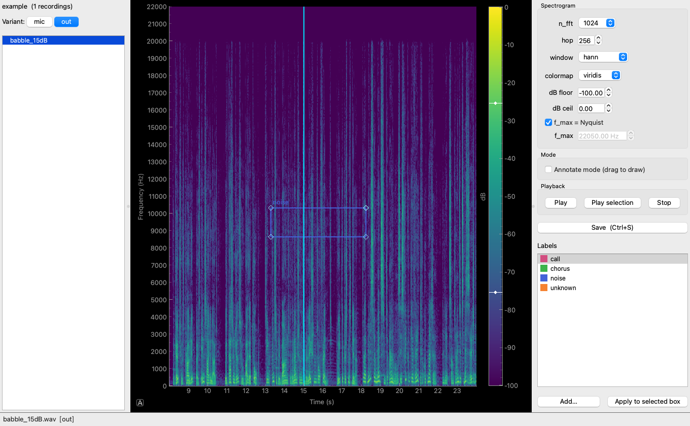

# Cicada — Spectrogram Annotation Tool

Cicada is a lightweight, open-source desktop tool for annotating audio
spectrograms — **labelme, but for sound**. Open your audio, draw labelled boxes
over regions of the spectrogram (calls, chorus, noise, …), and save each file's
annotations to a JSON sidecar. Every box is stored in physical
**time × frequency** units, so annotations stay meaningful regardless of how the
spectrogram is rendered.



Built with **PySide6 + pyqtgraph**; spectrograms via **scipy**, audio I/O via
**soundfile**, playback via **sounddevice**.

## Features

- 🟦 **Box annotation** — draw, move, resize and label rectangles over the
  spectrogram. Each box's `(x, y)` maps directly to `(time, frequency)`.
- 🔁 **Paired variants** — group different processing stages of the same
  recording (e.g. `mic` vs enhanced `out`) and flip between them while the view
  stays locked to the same time/frequency window for easy comparison.
- ▶️ **ocenaudio-style playback** — a click sets a play cursor, `Space`
  plays/pauses, and the cursor animates along as it plays.
- 🎛️ **Live spectrogram controls** — FFT size, hop, window, colormap, dB range
  and max frequency, all re-rendered instantly without disturbing your boxes.
- 🏷️ **Custom labels** — a predefined palette plus add-your-own, each with a
  colour.
- 💾 **JSON sidecars** — one `<audio>.json` per file, human-readable, with
  time/frequency coordinates as the source of truth.

## Requirements

- Python **≥ 3.10**
- A working audio output device for playback (optional — the app runs without
  one; playback just reports a status message).

## Installation

The recommended path is conda, which also pulls the native libraries
(`portaudio`, `libsndfile`) that the Python wheels bind to:

```shell
conda env create -f environment.yml
conda activate cicada
```

This creates an env named `cicada` (Python 3.11) and installs the package in
editable mode (`pip install -e .`).

<details>
<summary>Alternative: plain pip / venv</summary>

```shell
python -m venv .venv && source .venv/bin/activate
pip install -e .
```

You must have PortAudio and libsndfile available on your system (e.g.
`brew install portaudio libsndfile` on macOS) for playback and audio loading.
</details>

## Quick start

Generate a few known-content sample clips and open them:

```shell
python tools/make_sample.py /tmp/cicada_samples   # chirps + tone bursts
python -m cicada                                  # or just: cicada
```

In the app: **File → Open Folder…**, pick `/tmp/cicada_samples`, tick
**Annotate mode**, and drag a box around a tone burst.

## Concepts: recordings & variants

When you open a folder, Cicada inspects its **immediate subfolders**. Any
subfolder containing `.wav` files becomes a **variant**, and files that share a
name across variants are grouped into a single **recording**:

```
example/
  mic/  babble_15dB.wav   ┐  recording "babble_15dB"
  out/  babble_15dB.wav   ┘  variants: [ mic | out ]
```

The file list then shows **one row per recording**, with a `Variant:` button bar
to switch between e.g. the raw mic capture and the enhanced output. Switching
variants keeps the spectrogram at the **same time/frequency window**, so the two
versions line up pixel-for-pixel for comparison.

Each variant is annotated **independently**: its boxes are saved to a sidecar
next to *that* variant's wav (`mic/babble_15dB.json`, `out/babble_15dB.json`).

> If the opened folder has no variant subfolders (just loose `.wav` files,
> possibly nested), Cicada falls back to a flat list — one row per file.

## Usage

1. **Open Folder…** — recordings are listed; a `✓` marks ones whose current
   variant is already annotated.
2. **Select a recording** to render its spectrogram. Use the **Spectrogram**
   controls (n_fft, hop, window, colormap, dB floor/ceil, f_max / Nyquist) to
   tune the view live — re-rendering never moves existing boxes, because they
   live in time/frequency coordinates.
3. **Annotate**: tick **Annotate mode**, then drag on the spectrogram to draw a
   box. **Double-click** a box to select it; drag its body to move or its corner
   handles to resize; `Delete` / `Backspace` removes the selection.
4. **Label**: in the **Labels** panel pick the active label (used for new
   boxes), **Add…** a new one, or **Apply to selected box** to relabel.
5. **Compare variants**: click the variant bar or press `V` to switch; the view
   stays put.
6. **Play**: single-click the spectrogram to drop the cyan play cursor, then
   `Space` to play/pause from it. **Play selection** plays the selected box's
   time span; **Stop** halts.
7. **Save**: `Ctrl+S` (or the button) writes the sidecar next to the wav.
   Annotations also autosave when you switch recordings/variants.

### Keyboard & mouse

| Action               | Input                       |
|----------------------|-----------------------------|
| Set play cursor      | Single-click the spectrogram |
| Play / Pause         | `Space`                     |
| Draw box             | Drag (in Annotate mode)     |
| Select box           | Double-click the box        |
| Move / resize box    | Drag body / corner handles  |
| Delete box           | `Delete` / `Backspace`      |
| Cycle variant        | `V`                         |
| Next / Prev recording| `Ctrl+→` `]` / `Ctrl+←` `[` |
| Save                 | `Ctrl+S`                    |

## JSON sidecar schema

Each audio file `foo.wav` gets a sibling `foo.json`:

```json
{
  "version": "1.0",
  "audio_file": "foo.wav",
  "audio_meta": {"sample_rate": 44100, "duration": 12.5, "n_channels": 1},
  "spectrogram": {"n_fft": 1024, "hop": 256, "window": "hann", "f_max": 22050.0},
  "boxes": [
    {"label": "call", "t_start": 1.0, "t_end": 2.0,
     "f_low": 100.0, "f_high": 200.0,
     "px": {"x": 10.0, "y": 20.0, "w": 30.0, "h": 40.0}},
    {"label": "noise", "t_start": 3.0, "t_end": 4.0,
     "f_low": 50.0, "f_high": 75.0, "px": null}
  ]
}
```

Box coordinates are **authoritative in physical units** — `t_start`/`t_end` in
seconds, `f_low`/`f_high` in Hz. The `px` pixel rectangle and the `spectrogram`
parameters are stored for reproducibility/visualization and can be recomputed;
`px` may be `null`.

## Configuration

Preferences persist between sessions under `~/.cicada/`:

- `config.json` — last folder, autosave toggle, spectrogram defaults
  (`n_fft=1024`, `hop=256`, `window=hann`), colormap (`viridis`).
- `labels.json` — your label palette. Defaults: `call`, `chorus`, `noise`,
  `unknown`.

## Project layout

```
src/cicada/
  app.py            MainWindow + entry point (python -m cicada)
  audio.py          load (soundfile) / play (sounddevice)
  spectrogram.py    STFT spectrogram (scipy) -> dB image
  models.py         Box / Annotation dataclasses + t/f<->pixel conversion
  io_json.py        JSON sidecar read/write
  label_config.py   label palette
  library.py        scan a folder into recordings × variants
  config.py         persisted app settings
  widgets/
    spectrogram_view.py  pyqtgraph view: image, ROI boxes, playhead
    box_item.py          a labelled, resizable ROI rectangle
    file_list.py         recordings list + variant switcher
    label_panel.py       label palette UI
    controls.py          spectrogram params + playback controls
tests/                unit tests (spectrogram math, t/f<->px, JSON round-trip)
tools/make_sample.py  synthetic chirp / tone-burst generator
```

## Development

```shell
conda activate cicada
pytest                 # run the test suite
```

## Note

The original Tkinter-based tool (file-level CSV labels) has been retired and is
preserved under `Archive/` for reference.

## License

See [LICENSE](LICENSE).
